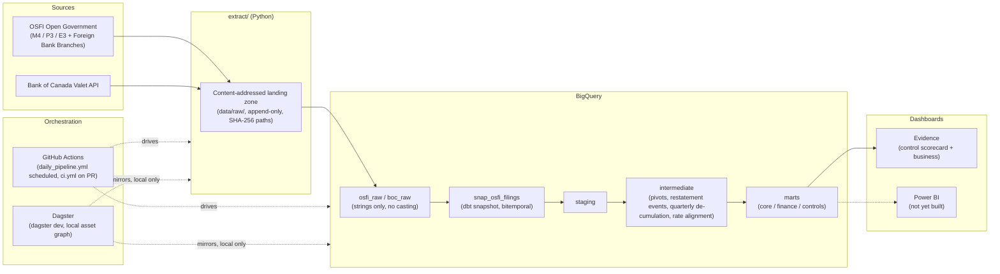
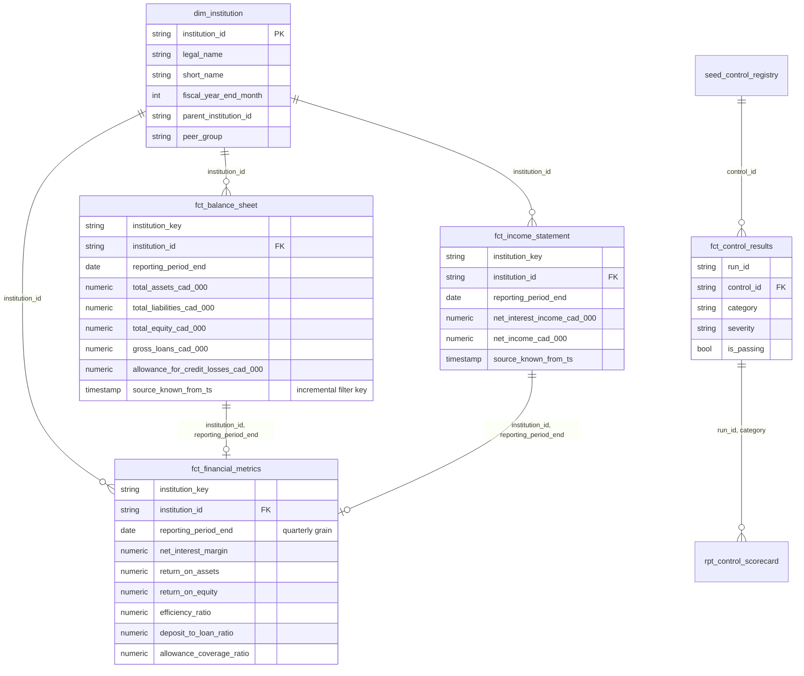

# Bank Regulatory Platform

A bitemporal data platform for Canadian bank regulatory reporting: ingests
OSFI's monthly and quarterly bank financial returns (M4/P3/E3) plus Bank of
Canada policy rate data, models them in dbt Core with a formal
BCBS-239-referenced data control framework, and serves the result through
two dashboards.

**Dashboards** (local for now — see [Known limitations](#known-limitations)):
control scorecard at `dashboards/evidence/pages/home.md`, business dashboard
at `dashboards/evidence/pages/business.md`. Run `evidence dev` from
`dashboards/evidence/` to view them.

**dbt docs**: generated and published to GitHub Pages on every push to
`main` via `.github/workflows/docs.yml` —
**[live here](https://ssondhi2027.github.io/bank-regulatory-platform/)**.

---

## Proof: a restatement, captured

The whole point of the bitemporal snapshot is that a regulatory filing can
be revised after the fact, and this platform can answer "what did we know,
and when." This is that proof, run for real against this repo's data (not
a screenshot — the actual before/after values):

**Before** — RBC (`institution_id = 27997`), reporting period `2026-06-30`:

```
total_assets_cad_000 = 2,807,100,076
source_known_from_ts = 2026-08-21 22:18:02.207781 UTC
```

A corrected M4 file was landed as a new content-addressed file (append-only
— the original is never touched), reloaded, and re-snapshotted. `dbt run`
on `fct_balance_sheet` — **incremental, not `--full-refresh`** — merged
exactly **1 row**:

```
1 of 1 OK created sql incremental model finance.fct_balance_sheet
  [MERGE (1.0 rows, 506.0 KiB processed)]
```

**After**, same key:

```
total_assets_cad_000 = 2,807,600,076   (+500,000, the exact injected delta)
source_known_from_ts = 2026-08-25 18:26:... UTC
```

That the incremental model touched precisely one row — not a full rebuild,
not zero rows (the silent-drop failure mode) — is the actual claim being
tested. See [Problem: incremental filters must key off knowledge
time](#problem-incremental-filters-must-key-off-knowledge-time-not-business-time)
below for why this is harder than it sounds.

---

## Architecture



## Data model (marts)



---

## Control framework

21 controls registered in `seeds/seed_control_registry.csv`, mapped to
BCBS 239 principles. **5 are implemented and passing on real data as of
this writing; the rest are registered but not implemented** — see why in
[Known limitations](#known-limitations). This table is generated from the
actual seed file, not hand-maintained separately.

| Control | Category | Severity | Description | Status |
|---|---|---|---|---|
| REC-001 | Reconciliation | error | Assets equal liabilities plus equity per institution per period | ✅ Implemented |
| REC-002 | Reconciliation | error | Child line items sum to declared parent subtotal | ✅ Implemented (M4 only) |
| REC-003 | Reconciliation | error | Net income reconciles to revenue less expenses, provisions and tax | ✅ Implemented |
| REC-004 | Reconciliation | warn | Retained earnings roll forward across consecutive periods | ⛔ Not implementable — see below |
| REC-005 | Reconciliation | error | Net income agrees between income statement and equity section | ⛔ Not implementable — see below |
| REC-006 | Reconciliation | error | Restated versions satisfy the balance sheet identity | Not yet implemented |
| REC-007 | Reconciliation | error | Computed industry aggregate equals published total across domestic, foreign subsidiaries and foreign branches | ✅ Implemented |
| CMP-001 | Completeness | error | Every active institution has a filing for the period | ✅ Implemented (FYE-cohort aware) |
| CMP-002 | Completeness | error | No missing periods in an institution's filing sequence | Not yet implemented |
| CMP-003 | Completeness | warn | All mandatory line items present in each return | Not yet implemented |
| CMP-004 | Completeness | warn | Ingested row count within tolerance of trailing average | Not yet implemented |
| VAL-001 | Validity | error | Amount values are populated and numeric | Partially covered by generic dbt tests |
| VAL-002 | Validity | warn | Line items follow expected sign conventions | Not yet implemented |
| VAL-003 | Validity | error | Institution identifier exists in the registry | Partially covered by generic dbt tests |
| VAL-004 | Validity | error | Reporting period end is a valid month or quarter end | Not yet implemented |
| VAL-005 | Validity | error | All amounts expressed in thousands of Canadian dollars | Not yet implemented |
| TML-001 | Timeliness | warn | OSFI filings received within expected publication lag | Source freshness thresholds pinned (`_osfi__sources.yml`), not yet a scored control |
| TML-002 | Timeliness | error | Rate series has an observation for every business day | Not yet implemented |
| PLA-001 | Plausibility | warn | Period-over-period asset change within expected band | Not yet implemented |
| PLA-002 | Plausibility | warn | Net interest margin falls in a plausible range | Not yet implemented |
| PLA-003 | Plausibility | error | Exactly one current version per filing line key | Enforced structurally by the snapshot's `unique_key`, not a separate scored control |

Every implemented control's outcome is captured by `macros/log_dbt_results.sql`
(an `on-run-end` hook) into `dbt_test_log`, joined back to the registry by
`fct_control_results`, and aggregated by run × category in
`rpt_control_scorecard` — pass rate, breach count, worst-severity breach,
trailing 30-day pass rate.

---

## Problems I hit and how I solved them

These are the ones worth an interviewer's time — real breaks, not
tidied-up summaries. Full detail (with actual numbers) is in
`docs/known_data_issues.md`, which is the running log this section is
drawn from.

### Problem: OSFI changes its own line-item codes over 30 years of history

REC-001 (balance sheet identity) failed on **1,712 of 3,533 rows** the
first time it ran, with variances up to **~$214B** on a single
institution-period. Root cause: 8 of the 12 deposit codes the liability
rollup summed had **zero rows anywhere** in the data before ~2009 — OSFI
restructured M4's deposit detail codes around that time, the same pattern
later confirmed for P3 (`net_income`, code `1109`, doesn't exist before
2011). The fix wasn't a code-mapping patch — it was applying the 5-year
scope window that was always the documented design intent
(`docs/project_structure.md`: "land full history, scope via config") but
had never actually been wired into staging. Full history stays in the
snapshot; only the marts narrow.

### Problem: a real double-counting bug hiding inside "correct-looking" validation logic

Two P3 codes (`1109` net income, `1168` comprehensive income) are each
validated by OSFI via **two independent, already-complete partitions**
(e.g. `1109 = before-discontinued + discontinued`, *and separately*
`1109 = non-controlling + equity-holders`). The hierarchy seed had
flattened both partitions into one child list per parent — summing all
four children double-counted the true total exactly 2x. Caught by
building REC-002 (subtotal rollup) and cross-checking against OSFI's own
Validation Rules XLSX, not by inspection.

### Problem: incremental filters must key off knowledge time, not business time

`fct_balance_sheet`'s incremental logic filters on `known_from_ts`
(derived from the snapshot's `dbt_valid_from`), never on
`reporting_period_end`. A restatement of a two-year-old period arrives
today with a *new* knowledge timestamp but an *old* business date —
filtering on the business date would silently and permanently drop it.
Proved with a real restatement, not just asserted — see
[above](#proof-a-restatement-captured).

### Problem: P3's year-to-date convention breaks naive ratio math

P3 reports income-statement figures **cumulatively within the fiscal
year** — Q2 is Q1+Q2, not Q2 alone. Computing NIM/ROA/ROE directly from
those figures would blend every earlier quarter into each later quarter's
ratio. Fixed with a dedicated de-cumulation step
(`int_filings__income_statement_quarterly.sql`) that differences
consecutive quarters, resetting at fiscal Q1. Caught a second, subtler bug
in the same feature: the first version of the average-balance calculation
computed `lag()` directly over `fct_balance_sheet`, which is **monthly**
grain — silently averaging against last *month's* balance instead of last
*quarter's* for every ratio. Fixed before it shipped; verified afterward
against RBC's real published NIM/ROE/efficiency ratio.

### Problem: CI could have silently overwritten production's tables

Found while wiring up Phase 9: a Phase 5 macro (`generate_schema_name.sql`)
made dev, prod, and CI all resolve to the **same physical BigQuery
tables** for anything with a custom schema — only seeds and the audit log
were actually isolated per target. Concretely, this meant an unreviewed
PR's CI run could overwrite the exact tables a scheduled production
pipeline serves from, before the PR was even merged. Fixed by isolating
the `ci` target specifically (prefixed, disposable schemas), while keeping
`dev`/`prod`'s shared naming as originally designed for a solo-developer
project.

### Problem: subsidiary double-counting in the industry-total reconciliation

REC-007 needed a residual explained: OSFI's own `Total All Banks`
aggregate didn't equal `Total Domestic` + `Total Foreign Bank Subsidiaries`
by **~$187.7B**. The missing piece was foreign bank **branches** — a
population OSFI tracks in an entirely separate dataset, absent from the
M4/P3/E3 institution rows altogether. Ingesting it required extending the
extractor with a second CKAN source, landed and schema-pinned the same way
the original three returns were. The dataset's own publication notes
confirm OSFI's totals already exclude subsidiary-of-subsidiary
double-counting, so no separate exclusion logic was needed on this end —
using OSFI's own published aggregates directly inherits it.

---

## Known limitations

- **Restatement history starts at first ingest.** The bitemporal snapshot
  can only reconstruct "what we knew, when" from the point this pipeline
  started running — it has no visibility into restatements that happened
  before that.
- **Scope is 5 years, six institutions plus subsidiaries with a known
  fiscal-year-end.** Full history is retained in the landing zone and
  snapshot; only the marts are windowed (`vars.scope_years` in
  `dbt_project.yml`). Widening scope is a var change, not a re-extraction
  — but institutions whose fiscal-year-end month is unconfirmed
  (subsidiaries beyond the Big Six) never get a resolved calendar quarter
  and so never appear in the quarterly marts.
- **REC-004 and REC-005 are not implementable against current data.** Both
  need OSFI codes (dividends declared, P3's own retained-earnings
  rollforward) that have **zero rows anywhere** in the loaded data —
  genuinely unfiled by every institution in scope, not a mapping gap. An
  approximation without the dividends term was considered and rejected: it
  would systematically false-fail every profitable, dividend-paying
  institution every quarter, which is worse than no control.
- **P3/E3's granular detail-line codes are largely unfiled in current-era
  data.** REC-002 is scoped to M4 only for this reason, verified by direct
  query (e.g. 5 of one P3 code's 6 declared children have zero rows
  anywhere in the scoped data) rather than assumed.
- **No tier 1 capital ratio.** Would need the CAP return, never ingested.
- **Dagster runs locally; GitHub Actions runs the real schedule.** These
  are deliberately not the same system — `orchestration/definitions.py`
  gives a demoable asset lineage graph via `dagster dev`, while
  `daily_pipeline.yml` is what would actually run a production schedule.
  Explained, not hidden.
- **`daily_pipeline.yml` and `ci.yml` haven't run against a real
  `workflow_dispatch`/PR yet** — `docs.yml` has (see below), which
  exercises the same secrets and GCP auth path, but not the extract/load/
  snapshot steps specific to the other two. Verified locally instead for
  `ci.yml`'s logic specifically: a deliberately broken control was picked
  up by slim CI's `state:modified+` selection and failed with exit code 1;
  reverted immediately after.
- **Getting `docs.yml` green in real GitHub Actions surfaced three more
  real bugs**, none visible from local development: `numpy==2.5.1`
  requires Python ≥3.12, but every workflow (and the project's declared
  stack) targets 3.11 — my local `.venv` had silently drifted to 3.12,
  masking it; `pywin32`/`pyreadline3` are Windows-only packages that ended
  up in `requirements.txt` from a `pip freeze` on this Windows dev
  machine, which don't exist on the Ubuntu runners CI uses; and GitHub
  Pages itself needed enabling in the repo's own settings before
  `deploy-pages` could publish anything; none of the three were
  discoverable without actually running the workflow for real, which is
  the entire reason to bother running it. All three fixed and verified —
  `docs.yml` is green, publishing to
  [`ssondhi2027.github.io/bank-regulatory-platform`](https://ssondhi2027.github.io/bank-regulatory-platform/)
  on every push to `main`.
- **Power BI version not built.** The build guide calls for both Evidence
  and Power BI versions of the dashboards; only Evidence is done. Power BI
  Desktop is a GUI-only tool that can't be driven from this environment.
- **Single source of restatement truth.** No independent audit trail
  beyond the snapshot itself; if the snapshot's own logic were wrong,
  nothing would catch it except the manual proof shown above.
- **No real access controls.** This is a portfolio project on a personal
  GCP project — the service accounts in use have broader permissions than
  a real multi-tenant production system would grant (see
  `docs/ci_cd_setup.md`'s note on reusing the extraction service account
  for Evidence rather than provisioning a least-privilege one, because the
  IAM API was disabled on this project and enabling it plus granting new
  roles was judged a bigger step than warranted for a personal project).
- **The line-item hierarchy is one person's judgment call.** Built by
  parsing OSFI's Data Dictionary and cross-checking against the
  Validation Rules XLSX, but a small number of ambiguous parent/child
  assignments were resolved by inspection rather than an authoritative
  OSFI source.

---

## Run instructions

```bash
# Setup
python -m venv .venv && source .venv/bin/activate   # or .venv\Scripts\activate on Windows
pip install -r requirements.txt
cp .env.example .env   # fill in GCP_PROJECT_ID, GOOGLE_APPLICATION_CREDENTIALS, BQ_LOCATION

# Extract and load
python extract/osfi_extract.py
python extract/boc_extract.py
python extract/load_bigquery.py
python extract/load_boc_bigquery.py

# Transform
cd transform
dbt deps
dbt snapshot
dbt build

# Verify a specific control
dbt test --select fct_balance_sheet

# Orchestration (local asset graph, screenshot-able lineage)
dagster dev   # localhost:3000

# Dashboards
cd dashboards/evidence
cp connection.yaml.example connection.yaml   # fill in your service account keyfile path
evidence dev   # opens the control scorecard and business dashboards

# dbt docs (also auto-published to GitHub Pages on push to main)
cd transform
dbt docs generate && dbt docs serve
```

See `docs/build_guide.md` and `docs/project_structure.md` for the full
phased build order and model layout this project follows, and
`docs/ci_cd_setup.md` for the GitHub Actions service account and secrets
setup.
